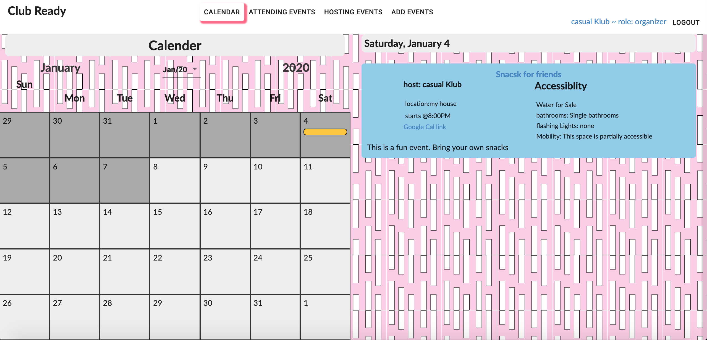
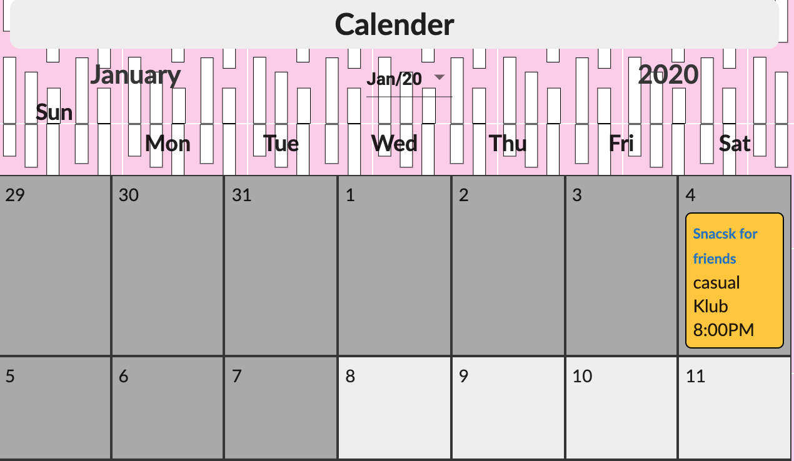
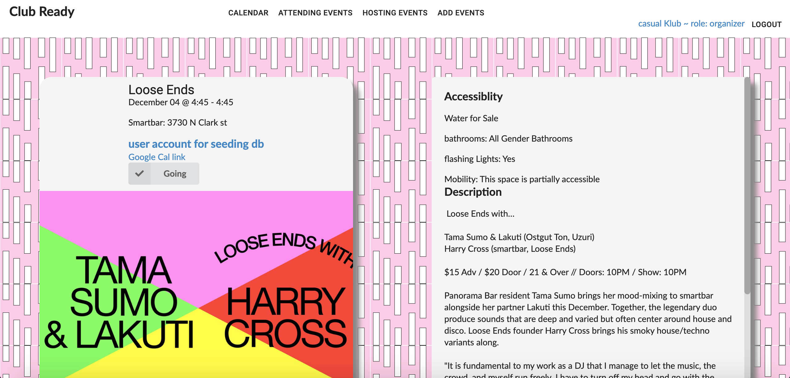
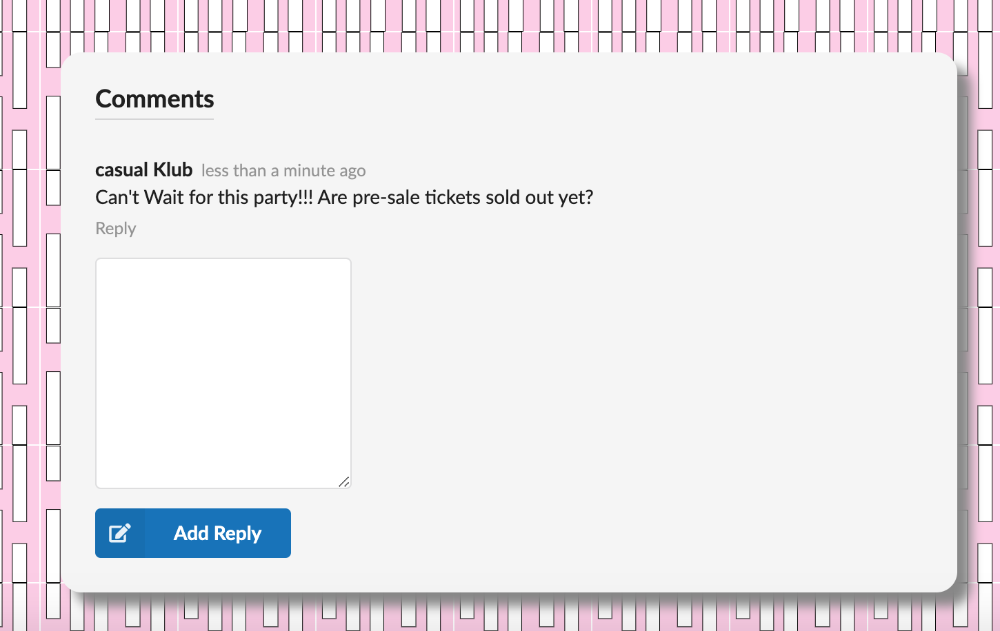
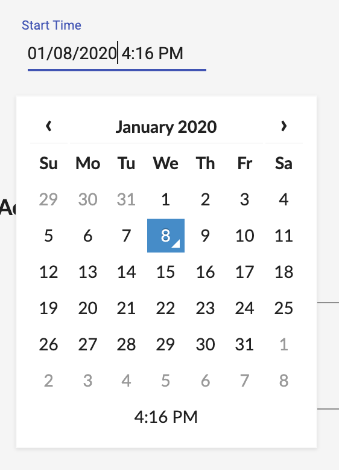
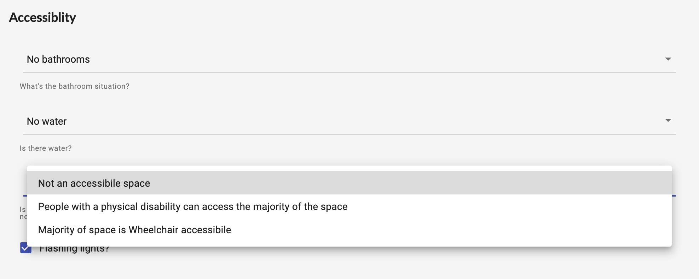
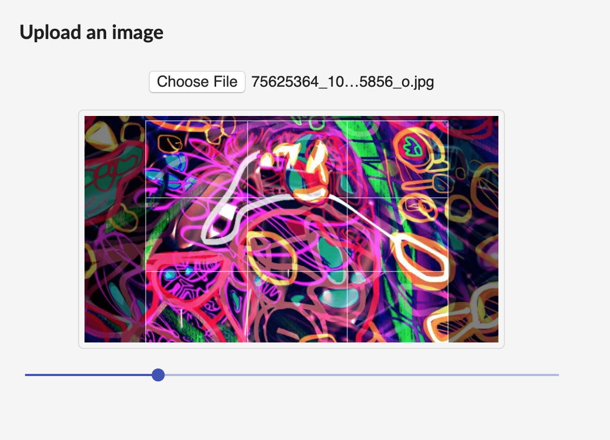
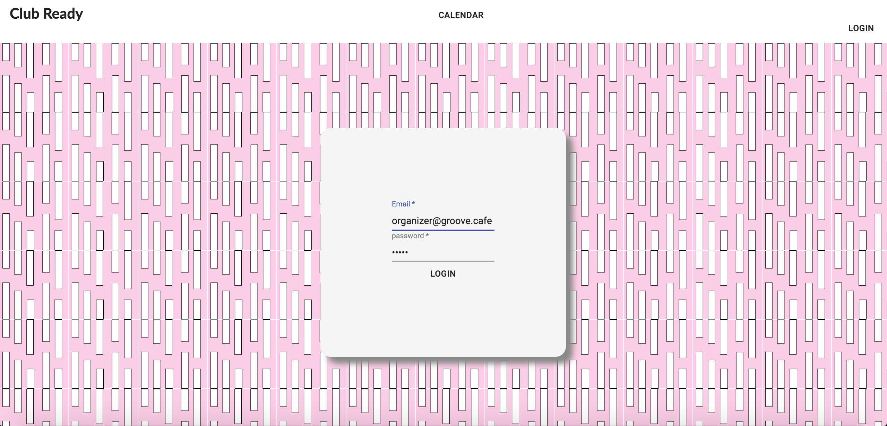

# Project sploopy

A React/Rails app for Underground and DIY community leaders, organizers, and community members to manage events. 

[Associated Rails API repo here](https://github.com/justrmarks/club-ready-api)

## Background

Underground and DIY communities have identified the problem of advertising spaces and events through platforms that both censor and monetize their content. This platform is one potential solution while also addressing problems of safety and accessibility as well as keeping organizers accountable by allowing the community to moderate itself. 

## Built with: 

* React
* Ruby on Rails
* PostgreSQL
* React-Redux
* [Moment.js](https://momentjs.com)
* [Pose - a simple Component animation library](https://popmotion.io/pose/)
* [Material UI](https://material-ui.com/)
* [react-easy-crop - a component that makes image cropping and processing on the client side a breeze](https://github.com/ricardo-ch/react-easy-crop)
* [react-datetime - a lightweight and easily customizable datetime picker component](https://github.com/YouCanBookMe/react-datetime)

## Current Features

* User authentication using JWT
* Different User roles: basic, organizer, admin
* Accessibility fields for Event model
  - Flashing lights
  - Bathrooms
  - Water
  - Wheelchair accessibility
* Event Image processing and storage
* User comments
* Calendar view
* Users can mark attendance

## Screenshots

Calendar events are shown home page with a master detail list of the month- events on the selected day with going and contact buttons on the detail

Calendar items expand on mouse hover

Event show page displays Event cover image, has link to associated Google Calendar Event, and going and contact button components

Authenticated Users can comment on Event Show pages

Event Create form utilizes react-datetime component for clean selection of Event start and end times

All events' accessibility fields are required on Event Create Form and default to values with least accessibility for transparency

Image Cropper component on Event Create form processes and normalizes Image data before uploading form data with simple UI of react-easy-crop

Login Form

